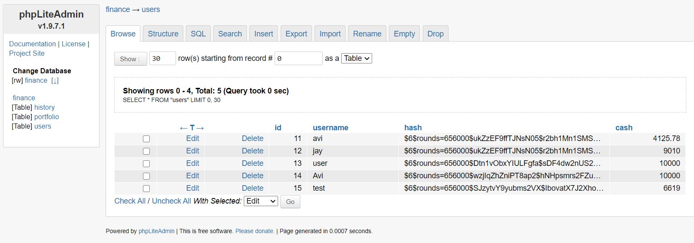
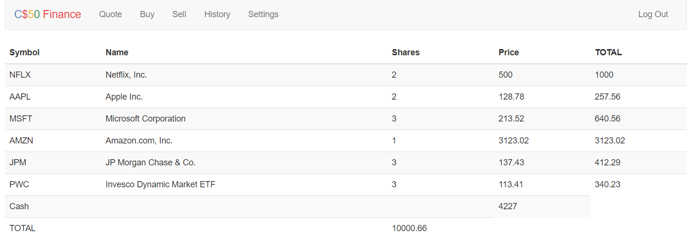
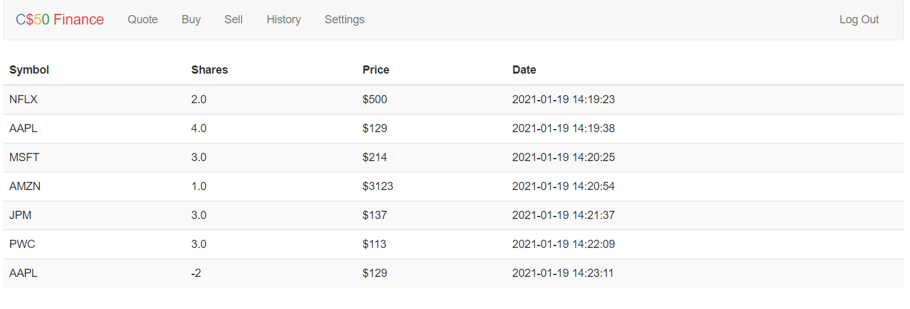

# Stock Exchange website
Designed a web-app which enables users to virtually buy and sell stocks. The app uses real world stock pricing from Yahoo Finance.
  
"CS50 Finance", a problem set from the HarvardX CS50 course, provides the foundation code for this project. For more information, click [here](https://docs.cs50.net/problems/finance/finance.html). If you wish to view the model solution, click [here](https://finance.cs50.net/login).
## Background
This web-app allows one to manage portfolios of stocks, including features that allow users to hypothetically 'buy' and 'sell' stocks. 
  
The prices of these stocks were initially queried via [Yahoo Finance](http://finance.yahoo.com/), which allows a retrieval of stock quotes in Comma Separated Values (CSV) format via URLs. However, the Yahoo Finance API underwent major updates in 2017 and 2019. Therefore, [yfinance](https://github.com/ranaroussi/yfinance) - a Python module that wraps the new API - was used instead.

## Project Files
### static/
This folder contains only one file, **styles.css** which renders the default styling for the web app. 
### templates/
All files in this folder are HTML markups that have been stylised with [**Bootstrap**](https://getbootstrap.com/), a front-end open source toolkit that provides incredibly responsive JavaScript plugins. All of these templates are rendered and called from **application.py**,  thereby allowing relaying of messages from different routes and flashing the said messages to the user. 
### finance. db
The database that encapsulates a table called _users_. Its schema specifies that each registered user receives 10k USD in cash.  All routes implemented in **application.py** query this file via the _db.execute_ command from the CS50 library.

### helpers.py
A helper file provided with the problem set material that defines some functions and/or their decorators, namely _apology, login_required,  lookup,_ and _usd_.
### application.py
The backbone of the Stock Exchange website. It uses [Flask](http://flask.pocoo.org/),  such that it allows storing user sessions on the local filesystem. Moreover, this file is also primarily responsible for making amendments to **finance.db**. This file defines the following routes:

 - Register: _inserts_ the user into the **users** table post authenticated sign up, and sets up the 'register.html' template.
 - Quote: Takes the stock symbol as input such that when the user instantiates the GET request, the 'quote.html' and 'quoted.html' templates are rendered. 
 - Buy: Looks up the stock price and the user portfolio in **users**. This route also implements the commands responsible for storing user transactions in **finance.db**. 
 - Index: Performs a lookup for each stock and returns a summary of the user porftilio, including user info, stocks owned, shares owned, stock price, and net balance.
 
 - Sell: Sells shares of stock and updates user's portfolio.
 - History: Returns all buy/sell transcations done by the user.
 
 - Password update: The "additional feature" of this problem set that allows a users to change their passwords. 
  
Note that all of the aforementioned routes perform error checking and render apologies as needed.
